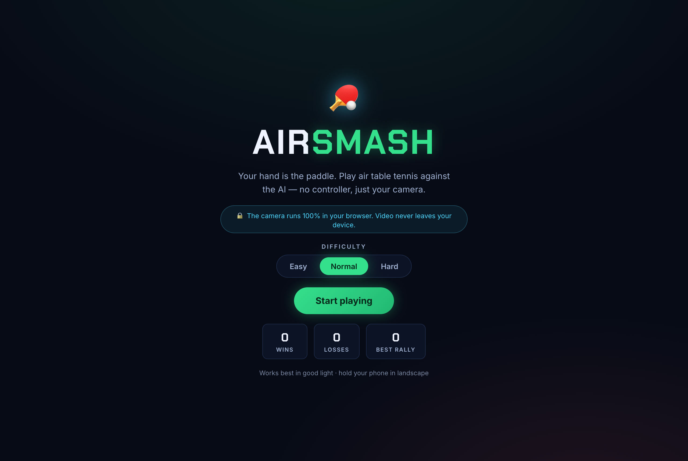
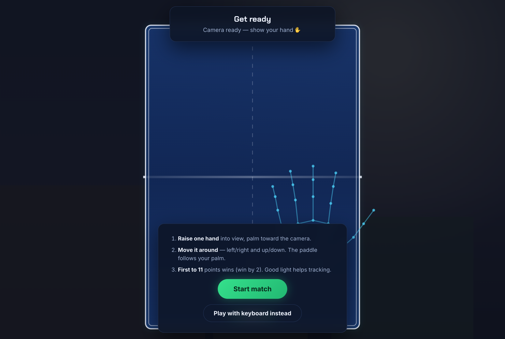
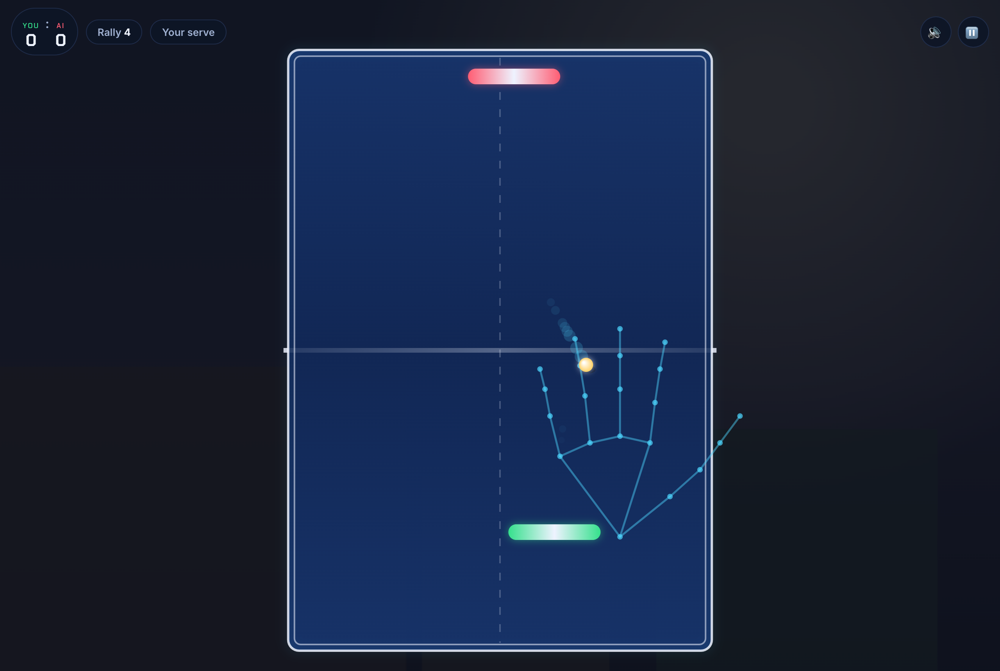
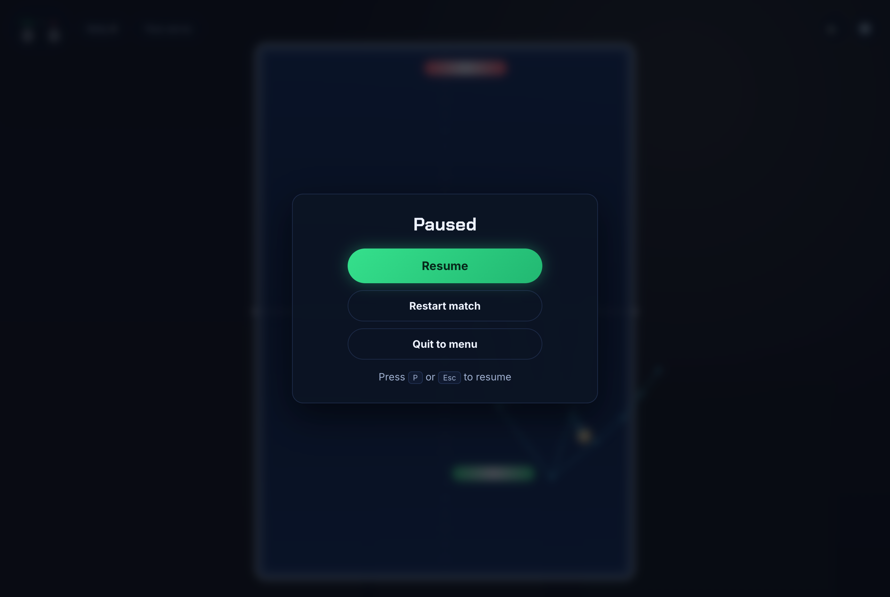
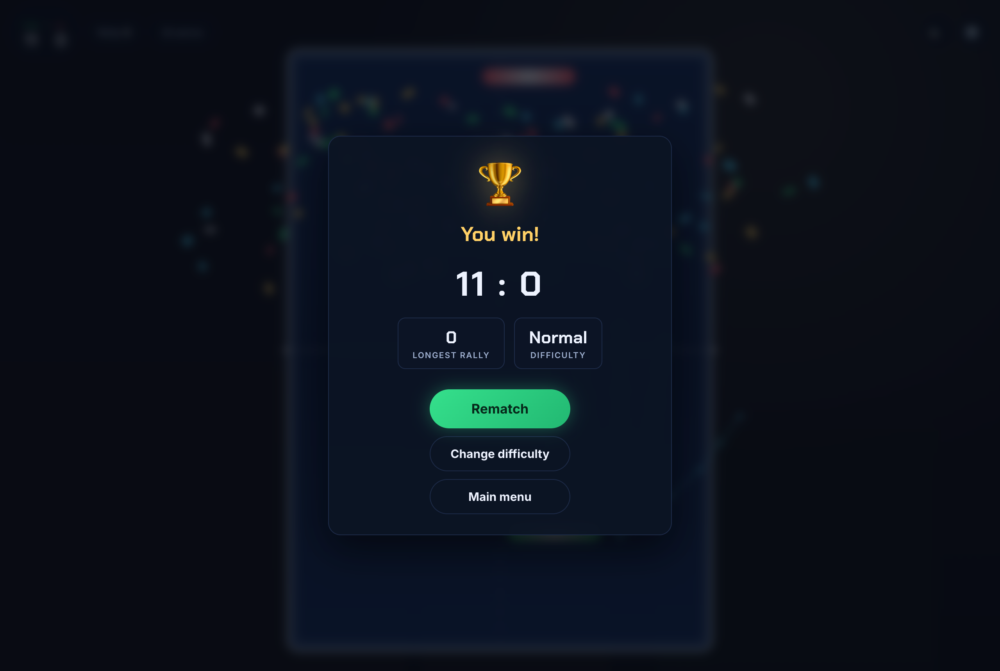

# AirSmash 🏓

**Your hand is the paddle.** AirSmash is air table tennis for the browser, played Kinect-style: stand in front of your camera, raise a hand, and swat the ball back at the AI. No controllers, no wearables — just you.

## Screenshots


*The intro: pick a difficulty, hit Start playing.*


*Setup: your camera feed with a live hand-skeleton overlay. Move your palm — the paddle follows.*


*Mid-rally: the camera ghosts behind the table, the ball streaks toward your paddle.*


*Pause overlay — resume, restart, or quit.*


*Match point: confetti, final score, longest rally.*

## The Idea

Motion games died with the console generation that hosted them — but every laptop and phone already has the one sensor they needed: a camera. AirSmash brings the pick-up-and-play joy of Kinect sports table tennis to any modern browser, with hand tracking that runs **entirely on your device**.

## How to Play

1. **Start playing** and allow camera access.
2. **Raise one hand**, palm toward the camera. When the paddle appears under your palm, hit **Start match**.
3. **Move your hand** left/right and up/down — the paddle mirrors you across your half of the table.
4. **Swat the ball back.** Where it hits your paddle sets the angle; how fast your hand is moving adds spin.
5. **First to 11 wins** (win by 2; sudden death at 15). Serve alternates every 2 points.

Ball past the AI's endline = your point. Past yours = AI's point.

## Features

- **Real hand tracking** — MediaPipe `HandLandmarker` runs in-browser via WebAssembly/GPU. Video **never leaves your device**.
- **Camera-behind-the-table view** — your mirrored feed shows faintly behind the arena with a glowing hand-skeleton overlay.
- **Three AI difficulties** — Easy, Normal, and Hard (Hard aims away from your paddle).
- **Spin physics** — paddle velocity at contact bends the ball; ball speed ramps up each hit of a rally.
- **Real-ish rules** — first to 11, win by 2, alternating serves every 2 points (every point at deuce).
- **Pause & resume** — button, `P`/`Esc`, and auto-pause when the tab loses focus.
- **Keyboard fallback** — arrow keys (or WASD) move the paddle if there's no camera.
- **Stats that persist** — wins, losses and best rally saved in `localStorage`.
- **Sound** — WebAudio blips pitched by ball speed, point chimes, win fanfare; mutable, persisted.
- **Mobile-ready** — fluid table sizing, big touch targets, safe-area support, reduced-motion respected.

## Controls

| Action | Input |
| --- | --- |
| Move paddle | Move your hand (or arrow keys / WASD) |
| Pause / resume | ⏸ button, <kbd>P</kbd> or <kbd>Esc</kbd> |
| Sound on/off | 🔊 button |

## Run It

No build step — plain HTML/CSS/JS. Internet is needed on first load (the hand-tracking model loads from a CDN, then caches).

```bash
# serve the folder (any static server works), e.g.:
python3 -m http.server 8000
# then open http://localhost:8000
```

> **Camera access requires `localhost` or HTTPS.** If you deploy it, serve over HTTPS.

Tips for best tracking: good lighting, plain-ish background, hand ~30–80 cm from the camera, palm facing the lens.

To regenerate the README screenshots and run the automated playthrough (workspace-local Playwright + Chromium):

```bash
node capture.js   # screenshots/*.png
node verify.js    # must end with ALL CHECKS PASSED
```

## Future Roadmap

- **2-player mode** — two people, one camera, one hand each.
- **Offline mode** — vendor the model + WASM so no CDN is needed.
- **Tournaments** — best-of-5 matches with difficulty ladder.
- **Paddle skins & trails** — unlockables tied to win streaks.
