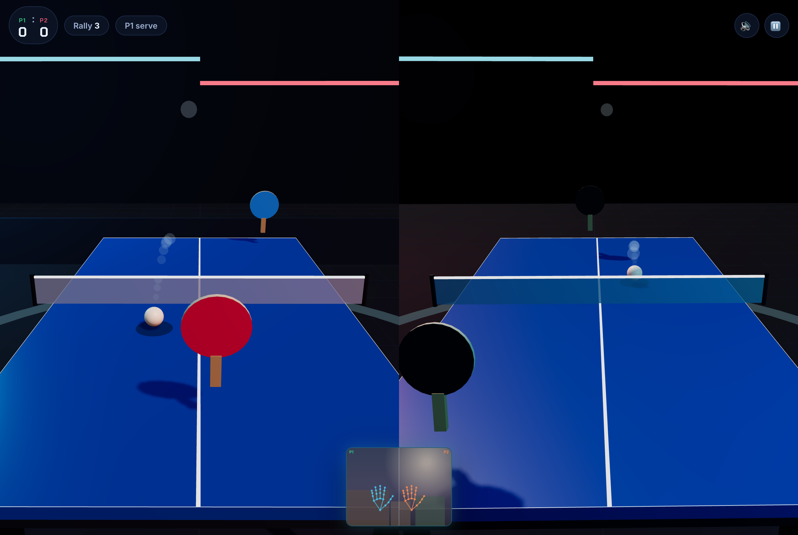

# AirSmash 🏓

**Your hand is the paddle.** AirSmash is first-person 3D table tennis for the browser, played Kinect-style: stand in front of your camera, raise a hand, and swing through the ball to return it over the net. No controllers, no wearables — just you. Grab a friend and pick **2 Players**: two hands, two paddles, one camera.

## Screenshots


*The intro: pick a mode (VS AI or 2 Players), pick a difficulty, hit Start playing.*


*Setup: the arena behind, with a live camera preview and hand-skeleton overlay. Move your palm — the paddle follows.*


*First-person view from behind your end of the table: the net, the AI opponent, and the ball arcing toward your paddle.*


*Two-player mode: split screen — P1's POV from the near end on the left, P2's from the far end on the right, with the camera preview split between them.*


*Pause overlay — resume, restart, or quit.*


*Match point: confetti, final score, longest rally.*

## The Idea

Motion games died with the console generation that hosted them — but every laptop and phone already has the one sensor they needed: a camera. AirSmash brings the pick-up-and-play joy of arcade table tennis (think Table Tennis Touch) to any modern browser, in full 3D, with hand tracking that runs **entirely on your device**.

## The View

- **First-person, behind the table** — the camera sits slightly above and behind your end. You see the full length of the table, the net, and your opponent on the far side, in a neon-lit arena.
- **Floating paddle** — no player model on your side; your paddle floats near the bottom of the screen and tracks your palm in 3D.
- **Picture-in-picture camera preview** — a small mirrored feed with your hand skeleton, so you can see what the tracker sees (big and centered during calibration, tucked into a corner during play).

## How to Play

1. **Start playing**, pick a mode, and allow camera access.
2. **Raise your hand** (both hands in 2-player mode; one per device in LAN mode), palm toward the camera. When you see it in the preview, hit **Start match**.
3. **Move your hand** left/right and up/down — the paddle mirrors you in 3D. In 2-player you face each other across the net: P1's POV fills the left half of the screen, P2's the right, and each hand drives its own paddle from its own half of the camera.
4. **Swing through the ball** to return it. Your swing speed adds power; your swing direction steers the shot. After a serve or return, the *other* player must hit it back.
5. **Your serve**: the ball floats beside your paddle — swipe through it to launch.
6. **First to 11 wins** (win by 2; sudden death at 15). Serve alternates every 2 points.

Real-ish rules: the ball must clear the net and land on the opponent's side. Miss it, let it bounce twice, or hit the net — and the point goes the other way.

## Two-Player Mode

- **Opposite ends, split screen.** P1 plays from the near end (left half of the screen), P2 from the far end (right half, rotated 180°) — you face each other across the net like real table tennis, sharing one camera and one keyboard.
- **Half-frame controls.** Each player owns half of the camera: P1's half of the frame stretches across the whole table for them, and the same for P2 — so nobody has to reach across into the other player's space to cover their side. P2's axis is flipped once more so moving your hand to *your* right moves *your* paddle to your right in your own view.
- **Split camera preview.** The PiP divides down the middle: P1's half of the feed (cyan skeleton, left) and P2's (orange, right), each labeled — matching each player's control region.
- **Same rules as vs-AI**: serves alternate every 2 points, faults are faults, deuce just works — the scoring engine treats P2 exactly like a far-side receiver. Wins/losses stats stay a "you vs AI" record; only best rally carries over from human-vs-human matches.
- **Keyboard fallback**: P1 = <kbd>W</kbd><kbd>A</kbd><kbd>S</kbd><kbd>D</kbd> + <kbd>Space</kbd>, P2 = arrow keys + <kbd>Enter</kbd> (arrow directions are relative to P2's own view).

## LAN Multiplayer (two devices)

Play from opposite sides of the real room — one device per player, same Wi-Fi:

```bash
node lan-server.js          # serves the game + relays match data (port 8000)
node lan-server.js 8080     # custom port
```

Open the printed `http://<ip>:<port>` address on both devices. The first device to connect is **Player 1 (host)**, the second **Player 2**; both show a hand, then the host taps *Start match*. The host runs the physics (~20 Hz state snapshots) while each device tracks its own hand locally, so neither paddle feels laggy — banners and sounds are replayed on the guest so both sides experience the same match. If a player disconnects or closes the tab, the other bounces back to the menu with a notice. No dependencies, no internet needed beyond the hand-tracking model download.

### Playing from a deployed site

A static host (GitHub Pages, Vercel…) can't relay WebSockets, so LAN 2P from a deployment needs a *relay*: any machine running `lan-server.js` — your own computer while you play, or a free Node host (Render / Railway / Fly). Pick **LAN 2P** on the menu and paste the relay's address into the **Relay server** box (e.g. `my-relay.fly.dev`), then share the deployed site's link with the other player. The address is remembered between visits; `?relay=<address>` in the URL works too. Leave the box blank to use the site itself as the relay (i.e. when it's served by `lan-server.js` directly).

## Performance Notes

Hand tracking is deliberately kept off the game's critical path:

- **Inference runs in a Web Worker** (`hand-worker.js`). The main thread only snapshots the camera frame (`createImageBitmap`, async + cheap) and transfers it; MediaPipe never blocks the render loop, so a slow CPU inference frame can't make the whole game judder. If workers are unavailable it falls back to the original synchronous path automatically.
- **Speed-adaptive smoothing** — slow hand movements are filtered hard (rock-steady aim) while fast swings pass through almost unfiltered, so the paddle keeps up instead of lagging a beat behind.

## Features

- **Real 3D** — Three.js arena with shadows, neon lighting, ball trail, and an AI opponent you can see across the net.
- **Real hand tracking** — MediaPipe `HandLandmarker` runs in-browser via WebAssembly/GPU (in a Web Worker). Video **never leaves your device**.
- **1P vs AI or 2-player local** — play against three AI difficulties, or share the near rail with a friend in 2 Players.
- **Motion swing controls** — paddle position *and* swing velocity are tracked; fast swings hit harder and add spin.
- **Ballistic physics** — gravity, table bounces, net collisions, and a shot solver that aims returns with net clearance.
- **Pause & resume** — button, `P`/`Esc`, and auto-pause when the tab loses focus.
- **Keyboard fallback** — arrows/WASD move the paddle, Space swings; in 2P each player gets their own keys.
- **Stats that persist** — wins, losses and best rally saved in `localStorage`.
- **Sound** — WebAudio blips pitched by ball speed, point chimes, win fanfare; mutable, persisted.
- **Mobile-ready** — fluid layout, big touch targets, safe-area support, reduced-motion respected.

## Controls

| Action | VS AI | 2 Players (one device) | LAN 2P (two devices) |
| --- | --- | --- | --- |
| Move paddle | Move your hand (or arrows / WASD) | P1: left hand · P2: right hand (split screen) | Your hand — each device tracks one player |
| Swing / serve | Swing through the ball (or <kbd>Space</kbd>) | Same — or <kbd>Space</kbd> (P1) / <kbd>Enter</kbd> (P2) | Same — keyboard: WASD/arrows move, <kbd>Space</kbd> swings |
| Pause / resume | ⏸ button, <kbd>P</kbd> or <kbd>Esc</kbd> | same | same — synced across both devices |
| Sound on/off | 🔊 button | same | per-device |

## Run It

No build step — plain HTML/CSS/JS with a vendored copy of Three.js. Internet is needed on first load (the hand-tracking model loads from a CDN, then caches).

```bash
# single device (any static server works), e.g.:
python3 -m http.server 8000
# then open http://localhost:8000

# two devices on the same network (LAN multiplayer):
node lan-server.js
# then open the printed http://<ip>:8000 address on BOTH devices
```

> **Camera access requires `localhost` or HTTPS.** If you deploy it, serve over HTTPS.

Tips for best tracking: good lighting, plain-ish background, hand ~30–80 cm from the camera, palm facing the lens. Big, deliberate swings return the ball best.

To regenerate the README screenshots and run the automated playthrough (Playwright + Chromium):

```bash
npm install                 # playwright (pinned to 1.45.1)
npx playwright install chromium
node capture.js             # screenshots/*.png
node verify.js              # must end with ALL CHECKS PASSED
```

## Development

No build step, no framework — plain HTML/CSS/JS with a vendored Three.js. The game logic lives in one file (`app.js`, banner-commented sections); `AGENTS.md` documents the architecture, invariants and recipes for common changes.

## License

ISC — see [LICENSE](LICENSE).

## Future Roadmap

- **Offline mode** — vendor the hand-tracking model + WASM so no CDN is needed.
- **Tournaments** — best-of-5 matches with a difficulty ladder (and a 2P bracket).
- **Paddle skins & trails** — unlockables tied to win streaks.
- **Doubles vs AI** — you + a friend on the same side against two bots.
